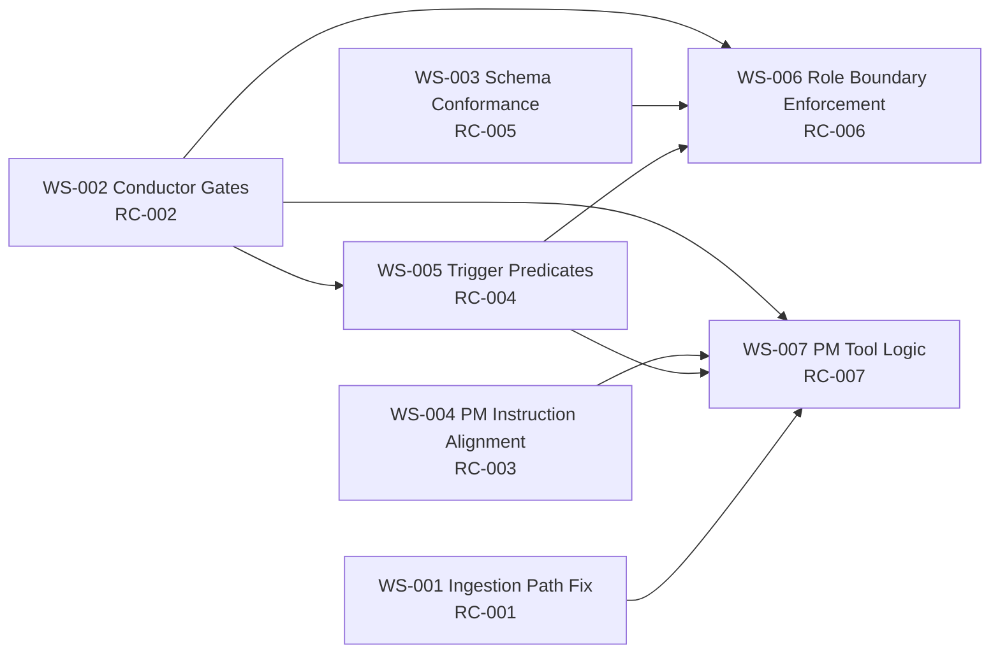

# Phase 5 Plan: Implementation Planning by Workstream

## Objective

Convert the Phase 4 remediation decision (REMOPT-B: Comprehensive Baseline Realignment) into seven implementation-ready workstreams with explicit sequencing, dependency contracts, Conductor checkpoints, effort estimates, and test outlines.

## Scope

- In scope:
  - Plan implementation for all seven RC-mapped workstreams:
    1. Workstream-Ingestion-Path-Fix (RC-001)
    2. Workstream-Conductor-Gates (RC-002)
    3. Workstream-Schema-Conformance (RC-005)
    4. Workstream-PM-Instruction-Alignment (RC-003)
    5. Workstream-Trigger-Predicates (RC-004)
    6. Workstream-Role-Boundary-Enforcement (RC-006)
    7. Workstream-PM-Tool-Logic (RC-007)
  - Define file-level change plans, sequencing, parallelization, and phase readiness gates.
  - Define verification path for Builder/Reviewer execution in Phase 6.
- Out of scope:
  - Implementing changes in the VIP environment.
  - Reopening Phase 3 root-cause findings or Phase 4 option selection.

---

## Phase Dependencies

| Dependency ID | Source | Required Artifact | Consumed For |
|---|---|---|---|
| DEP-PHASE5-001 | Phase 4 | evidence/phase-4-recommendation-and-rationale.md | Confirms REMOPT-B selection and no deferred RC domains |
| DEP-PHASE5-002 | Phase 4 | evidence/phase-4-rc-remediation-traceability.md | RC-to-workstream mapping and completeness check |
| DEP-PHASE5-003 | Phase 4 | evidence/phase-4-remediation-option-scopes.md | Confirms all 7 RCs are in selected scope |
| DEP-PHASE5-004 | Phase 3 | evidence/phase-3-gap-rc-links.md | Gap-to-RC dependency fan-in for sequencing |
| DEP-PHASE5-005 | Phase 2 | evidence/phase-2-orchestration-contract-map.md | BAS-CONTRACT obligations for checkpoints and handoffs |
| DEP-PHASE5-006 | Phase 2 | evidence/phase-2-trigger-condition-catalog.md | Trigger predicate requirements (BAS-TRIG-006 and PM trigger behavior) |
| DEP-PHASE5-007 | Phase 2 | evidence/phase-2-output-schema-contracts.md | BAS-SCHEMA-001/002/003/004 required fields |

Pre-condition gate: all DEP-PHASE5-* artifacts must exist and contain substantive rows before implementation begins.

---

## Workstream Summary Matrix

| Workstream | RC | Primary GAP Coverage | Effort (Ideal Days) | Blocking Type | Primary Conductor Gate |
|---|---|---|---:|---|---|
| Workstream-Ingestion-Path-Fix | RC-001 | GAP-001, GAP-002 | 1-2 | Foundation blocker | BAS-GATE-001 (task-init dependency visibility) |
| Workstream-Conductor-Gates | RC-002 | GAP-001, GAP-002, GAP-003, GAP-007 | 2-3 | Foundation blocker | BAS-GATE-001/002/003 |
| Workstream-Schema-Conformance | RC-005 | GAP-003, GAP-004 | 2-3 | Soft blocker for planning outputs | BAS-GATE-002 (plan review schema check) |
| Workstream-PM-Instruction-Alignment | RC-003 | GAP-005 | 1 | Soft dependency for PM logic | BAS-GATE-002 (instruction contract confirmation) |
| Workstream-Trigger-Predicates | RC-004 | GAP-004, GAP-006 | 2 | Hard dependency for WS-006/WS-007 | BAS-GATE-002 + BAS-GATE-003 preconditions |
| Workstream-Role-Boundary-Enforcement | RC-006 | GAP-003, GAP-007 | 2 | Depends on WS-002 + WS-005 | BAS-GATE-003 (implementation-start boundary) |
| Workstream-PM-Tool-Logic | RC-007 | GAP-005, GAP-006 | 2-3 | Depends on WS-004 + WS-005 | BAS-GATE-003 (PM recommendation completion gate) |

---

## Implementation Sequence and Parallelization

### Dependency Diagram



### Sequencing Guidance

1. Wave 1 (blocking foundations): WS-001 and WS-002 in parallel.
2. Wave 2 (contract alignment): WS-003 and WS-004 in parallel after WS-002 starts and checkpoint definitions are available.
3. Wave 3 (routing logic): WS-005 after WS-002 baseline gates are in place.
4. Wave 4 (policy enforcement and PM behavior): WS-006 and WS-007 in parallel after WS-005, with WS-007 also requiring WS-004.
5. Stabilization: integrated end-to-end run across all four acceptance domains.

### Critical Path

WS-002 -> WS-005 -> (WS-006 and WS-007) -> Integrated validation.

### Critical Path Timing Assumptions (Deterministic)

- CPA-001: WS-007 cannot start before WS-001 reaches CP-WS1-002 and publishes ingestion-state evidence (resolved-path or explicit blocker-state artifact).
- CPA-002: WS-007 cannot start before WS-004 reaches CP-WS4-001 and publishes approved recommendation-contract language for BAS-SCHEMA-003.
- CPA-003: WS-007 can run only after WS-005 trigger predicates are baselined; if WS-005 is incomplete, WS-007 remains in hold state regardless of WS-001/WS-004 readiness.
- CPA-004: Schedule risk classification is `HIGH` if WS-001 or WS-004 completion slips beyond WS-005 readiness date, because WS-007 is dual-gated by ingestion evidence and recommendation-contract readiness.
- CPA-005: If any CPA precondition is unmet at wave handoff, the phase remains in Wave 3 with no partial WS-007 execution.

---

## Detailed Workstream Plans

### Workstream 1: Workstream-Ingestion-Path-Fix (RC-001)

- Goal: restore deterministic binary-conversion path resolution and explicit blocker visibility for ingestion completion.
- Dependencies:
  - Upstream: none.
  - Downstream consumers: WS-007 verification (PM logic should consume clean ingestion state).

#### Detailed File Changes

| Change ID | File Path | Change Type | Planned Change |
|---|---|---|---|
| WS1-FILE-001 | C:/Users/s1058662/OneDrive - Syngenta/workspace/Projects/2026_01_VIP/.tasks/005-pm-agent-system/task.md | Update | Add explicit ingestion tooling-path configuration contract and fallback behavior requirement (conversion executable/env binding + failure-state emission). |
| WS1-FILE-002 | C:/Users/s1058662/OneDrive - Syngenta/workspace/Projects/2026_01_VIP/.tasks/005-pm-agent-system/plan/phase-5-projectmanager-orchestration-layer.md | Update | Add path-resolution decision tree, fallback handling, and required checkpoint output when dependency is unresolved. |
| WS1-FILE-003 | C:/Users/s1058662/OneDrive - Syngenta/workspace/Projects/2026_01_VIP/learning_base/ideas/chat_logs/pm_agent_improvements/*.json (new validation exports) | Create | Capture before/after ingestion run evidence proving resolved tool path and persisted completion/blocker state. |

#### Implementation Steps

1. TASK-WS1-001: define canonical ingestion conversion path contract (env var name, expected executable, fallback behavior).
2. TASK-WS1-002: define failure-output schema for unresolved dependency states (must surface blocker + decision options).
3. TASK-WS1-003: define verification scenario set for binary and non-binary ingestion documents.

#### Conductor Checkpoints

- CP-WS1-001 (BAS-GATE-001): task initialization confirms ingestion tooling prerequisites.
- CP-WS1-002 (BAS-CONTRACT-010 boundary): unresolved dependency path must pause with explicit user decision controls.

#### Test Plan Outline

- Positive: binary conversion succeeds; completion-state artifact is persisted.
- Negative: conversion tool unavailable; blocker-state message and checkpoint are emitted.
- Regression: non-binary documents continue through ingestion without false blocker states.

---

### Workstream 2: Workstream-Conductor-Gates (RC-002)

- Goal: enforce BAS-GATE-001, BAS-GATE-002, BAS-GATE-003 across orchestration transitions.
- Dependencies:
  - Upstream: none.
  - Downstream consumers: WS-005, WS-006, WS-007.

#### Detailed File Changes

| Change ID | File Path | Change Type | Planned Change |
|---|---|---|---|
| WS2-FILE-001 | C:/Users/s1058662/OneDrive - Syngenta/workspace/Projects/2026_01_VIP/.tasks/005-pm-agent-system/task.md | Update | Add mandatory checkpoint table with gate IDs, preconditions, required outputs, and hold/continue rules. |
| WS2-FILE-002 | C:/Users/s1058662/OneDrive - Syngenta/workspace/Projects/2026_01_VIP/.tasks/005-pm-agent-system/plan/phase-5-projectmanager-orchestration-layer.md | Update | Embed explicit checkpoint state machine for task-init, plan-review-complete, implementation-start boundaries. |
| WS2-FILE-003 | C:/Users/s1058662/OneDrive - Syngenta/workspace/Projects/2026_01_VIP/.tasks/005-pm-agent-system/artifacts/phase-11/e2e-execution-log.md | Update | Add gate pass/fail evidence rows showing pauses and user-control checkpoints. |

#### Implementation Steps

1. TASK-WS2-001: define gate preconditions and forbidden transitions per BAS contracts.
2. TASK-WS2-002: define state transitions and checkpoint output template (pass/hold/fail).
3. TASK-WS2-003: define fallback branch for blocked gates (return with action options).

#### Conductor Checkpoints

- CP-WS2-001: BAS-GATE-001 enforced before any delegation.
- CP-WS2-002: BAS-GATE-002 enforced after phase plan review evidence.
- CP-WS2-003: BAS-GATE-003 enforced before implementation/delegation activation.

#### Test Plan Outline

- Sequence test: orchestration cannot skip gate order.
- Hold test: missing prerequisite triggers hold state with explicit options.
- Recovery test: user selection resumes at correct gate with preserved state.

---

### Workstream 3: Workstream-Schema-Conformance (RC-005)

- Goal: enforce BAS-SCHEMA-001, BAS-SCHEMA-002, BAS-SCHEMA-004 for BA and Scrum Master outputs.
- Dependencies:
  - Upstream: WS-002 checkpoint definitions available.
  - Downstream consumers: WS-006 handoff enforcement; Phase 6 planner import validation.

#### Detailed File Changes

| Change ID | File Path | Change Type | Planned Change |
|---|---|---|---|
| WS3-FILE-001 | C:/Users/s1058662/OneDrive - Syngenta/workspace/Projects/2026_01_VIP/.tasks/005-pm-agent-system/task.md | Update | Add required planner-ready output section list and issue-checklist mandatory fields for BA/Scrum outputs. |
| WS3-FILE-002 | C:/Users/s1058662/OneDrive - Syngenta/workspace/Projects/2026_01_VIP/.tasks/005-pm-agent-system/plan/phase-5-projectmanager-orchestration-layer.md | Update | Add schema validation checkpoints prior to plan handoff and implement-phase trigger. |
| WS3-FILE-003 | C:/Users/s1058662/OneDrive - Syngenta/workspace/Projects/2026_01_VIP/.tasks/005-pm-agent-system/artifacts/phase-11/pilot-readiness-report.md | Update | Add schema conformance evidence block and planner-import readiness checklist output. |

#### Implementation Steps

1. TASK-WS3-001: define canonical template sections/fields for BAS-SCHEMA-001/002/004.
2. TASK-WS3-002: define validation checklist and minimum-pass threshold before handoff.
3. TASK-WS3-003: define non-conformant output remediation route (request revision before progression).

#### Conductor Checkpoints

- CP-WS3-001: schema validation runs at BAS-GATE-002 and blocks progression on missing fields.
- CP-WS3-002: accepted schema state is recorded and carried into implementation-start boundary.

#### Test Plan Outline

- Field coverage test: generated planning output includes every required schema section.
- Failure test: missing field yields deterministic validation failure and revision action.
- Compatibility test: output shape aligns with planner workbook structure constraints.

---

### Workstream 4: Workstream-PM-Instruction-Alignment (RC-003)

- Goal: align PM instruction contract to BAS-SCHEMA-003 recommendation block obligation.
- Dependencies:
  - Upstream: none.
  - Downstream consumers: WS-007 PM recommendation logic.

#### Detailed File Changes

| Change ID | File Path | Change Type | Planned Change |
|---|---|---|---|
| WS4-FILE-001 | C:/Users/s1058662/OneDrive - Syngenta/workspace/Projects/2026_01_VIP/.tasks/005-pm-agent-system/task.md | Update | Add explicit PM recommendation block obligation with required fields (title, trigger rationale, framework, timing, output artifact). |
| WS4-FILE-002 | C:/Users/s1058662/OneDrive - Syngenta/workspace/Projects/2026_01_VIP/.tasks/005-pm-agent-system/plan/phase-5-projectmanager-orchestration-layer.md | Update | Add PM recommendation contract section and acceptance examples in blocker/governance scenarios. |
| WS4-FILE-003 | C:/Users/s1058662/OneDrive - Syngenta/workspace/Projects/2026_01_VIP/.tasks/005-pm-agent-system/artifacts/phase-11/e2e-execution-log.md | Update | Add recommendation-block presence assertion rows for qualifying contexts. |

#### Implementation Steps

1. TASK-WS4-001: define normalized BAS-SCHEMA-003 block format.
2. TASK-WS4-002: define context qualifiers that require recommendation emission.
3. TASK-WS4-003: define no-context behavior (explicitly state why recommendation is omitted).

#### Conductor Checkpoints

- CP-WS4-001: plan review includes contract text confirmation for PM recommendation block.

#### Test Plan Outline

- Contract test: PM output always contains recommendation block when qualifying context exists.
- Negative test: recommendation omission is allowed only with explicit non-qualifying rationale.

---

### Workstream 5: Workstream-Trigger-Predicates (RC-004)

- Goal: implement trigger predicates for BA planning-intent routing and PM risk/governance activation.
- Dependencies:
  - Upstream: WS-002 gate model.
  - Downstream consumers: WS-006, WS-007.

#### Detailed File Changes

| Change ID | File Path | Change Type | Planned Change |
|---|---|---|---|
| WS5-FILE-001 | C:/Users/s1058662/OneDrive - Syngenta/workspace/Projects/2026_01_VIP/.tasks/005-pm-agent-system/task.md | Update | Add explicit trigger predicate definitions equivalent to BAS-TRIG-006 and PM context trigger predicate. |
| WS5-FILE-002 | C:/Users/s1058662/OneDrive - Syngenta/workspace/Projects/2026_01_VIP/.tasks/005-pm-agent-system/plan/phase-5-projectmanager-orchestration-layer.md | Update | Add trigger evaluation flow with routing outcomes (BA->Scrum and PM recommendation activation path). |
| WS5-FILE-003 | C:/Users/s1058662/OneDrive - Syngenta/workspace/Projects/2026_01_VIP/.tasks/005-pm-agent-system/artifacts/phase-11/e2e-execution-log.md | Update | Add trigger-fired/not-fired evidence entries with predicate inputs and outputs. |

#### Implementation Steps

1. TASK-WS5-001: define predicate inputs for planning-intent trigger.
2. TASK-WS5-002: define predicate inputs for risk/governance trigger.
3. TASK-WS5-003: define deterministic routing outputs and fallback behavior when predicates fail.

#### Conductor Checkpoints

- CP-WS5-001: trigger evaluation must be logged before delegation decisions.
- CP-WS5-002: failed trigger states route to corrective message, not silent fallthrough.

#### Test Plan Outline

- BA routing test: planning intent triggers BA->Scrum handoff path.
- PM trigger test: unresolved blockers + stakeholder/governance signals activate PM recommendation path.
- Guardrail test: irrelevant context does not falsely trigger planning or PM branches.

---

### Workstream 6: Workstream-Role-Boundary-Enforcement (RC-006)

- Goal: enforce BA->Scrum Master->Builder boundary and prohibit bypass delegation.
- Dependencies:
  - Upstream: WS-002, WS-003, WS-005.
  - Downstream consumers: integrated coordination validation.

#### Detailed File Changes

| Change ID | File Path | Change Type | Planned Change |
|---|---|---|---|
| WS6-FILE-001 | C:/Users/s1058662/OneDrive - Syngenta/workspace/Projects/2026_01_VIP/.tasks/005-pm-agent-system/task.md | Update | Add explicit role boundary matrix (must-do and must-not-do transitions) for BA, Scrum Master, Builder. |
| WS6-FILE-002 | C:/Users/s1058662/OneDrive - Syngenta/workspace/Projects/2026_01_VIP/.tasks/005-pm-agent-system/plan/phase-5-projectmanager-orchestration-layer.md | Update | Add handoff guards requiring plan artifact path and review completion before Builder handoff. |
| WS6-FILE-003 | C:/Users/s1058662/OneDrive - Syngenta/workspace/Projects/2026_01_VIP/.tasks/005-pm-agent-system/artifacts/phase-11/e2e-execution-log.md | Update | Add boundary-violation test cases and expected block behavior evidence. |

#### Implementation Steps

1. TASK-WS6-001: define allowed role transitions and forbidden bypass transitions.
2. TASK-WS6-002: define guard conditions for BA output completeness and Scrum plan save requirements.
3. TASK-WS6-003: define rejection messages for boundary violations and reroute instructions.

#### Conductor Checkpoints

- CP-WS6-001: BAS-GATE-003 requires Scrum Master sign-off and saved plan path before implementation handoff.
- CP-WS6-002: boundary violations force hold state and corrective next actions.

#### Test Plan Outline

- Positive handoff chain test: BA->Scrum->Builder succeeds with required artifacts.
- Bypass prevention test: direct BA->Builder delegation is blocked with actionable correction.
- Stale artifact test: outdated or missing plan path blocks transition.

---

### Workstream 7: Workstream-PM-Tool-Logic (RC-007)

- Goal: implement proactive PM framework recommendation logic with context evaluation loop.
- Dependencies:
  - Upstream: WS-001, WS-002, WS-004, WS-005.
  - Downstream consumers: PM-recommendation acceptance domain completion.

#### Detailed File Changes

| Change ID | File Path | Change Type | Planned Change |
|---|---|---|---|
| WS7-FILE-001 | C:/Users/s1058662/OneDrive - Syngenta/workspace/Projects/2026_01_VIP/.tasks/005-pm-agent-system/task.md | Update | Add PM framework selection policy: initial framework set (RAID, RACI, Fishbone), qualification signals, output structure, and extensibility rule. |
| WS7-FILE-002 | C:/Users/s1058662/OneDrive - Syngenta/workspace/Projects/2026_01_VIP/.tasks/005-pm-agent-system/plan/phase-5-projectmanager-orchestration-layer.md | Update | Add context-evaluation loop and framework selection decision table integrated with trigger outputs. |
| WS7-FILE-003 | C:/Users/s1058662/OneDrive - Syngenta/workspace/Projects/2026_01_VIP/.tasks/005-pm-agent-system/artifacts/phase-11/pilot-readiness-report.md | Update | Add PM recommendation quality checks and framework-selection rationale evidence table. |

#### Implementation Steps

1. TASK-WS7-001: define qualifying context signals and weighting/selection logic.
2. TASK-WS7-002: define recommendation output template conforming to BAS-SCHEMA-003.
3. TASK-WS7-003: define conflict-resolution order when multiple frameworks qualify.

#### Conductor Checkpoints

- CP-WS7-001: PM recommendation generation is checked before final completion messaging.
- CP-WS7-002: recommendation block must include rationale-to-context mapping.

#### Test Plan Outline

- Qualifying-context test: blocker/stakeholder/governance context yields proactive recommendation.
- Multi-qualifier test: multiple framework candidates are ordered deterministically.
- Non-qualifying test: no recommendation only when explicit criteria are absent.

#### Explicit Scope Boundary: WS-004 vs WS-007

- WS-004 scope (contract-definition layer): trigger predicates, recommendation contract language, and obligation specifications.
- WS-007 scope (runtime decision layer): runtime qualification logic, selection logic, and decision ordering.
- Boundary rule BR-WS4-WS7-001: WS-007 must consume WS-004 contract artifacts as immutable inputs and must not redefine predicates/obligations at runtime.
- Boundary rule BR-WS4-WS7-002: WS-004 must not implement runtime framework ranking or execution-time conflict resolution.

---

## Cross-Workstream Conductor Checkpoint Map

| Checkpoint ID | Gate | Workstreams | Pass Condition |
|---|---|---|---|
| PH5-CP-001 | BAS-GATE-001 | WS-001, WS-002 | Initialization confirms dependencies, path tooling, and gate state before delegation |
| PH5-CP-002 | BAS-GATE-002 | WS-002, WS-003, WS-004, WS-005 | Plan review validates schema conformance, instruction alignment, and trigger definitions |
| PH5-CP-003 | BAS-GATE-003 | WS-002, WS-005, WS-006, WS-007 | Implementation start requires approved plan path, role boundary compliance, and recommendation-path readiness |
| PH5-CP-004 | BAS-CONTRACT-010 completion | WS-001..WS-007 | User-facing completion includes checkpoints, decision controls, and PM recommendation behavior where context qualifies |

---

## Fail-Fast Gate Criteria

Progression must stop immediately when any fail-fast condition is true.

| Gate ID | Fail-Fast Condition (Immediate Block) | Block Action |
|---|---|---|
| BAS-GATE-001 | Any required task-init dependency is unresolved or ingestion tooling-path evidence is absent/malformed. | Stop before delegation; emit blocker-state output with decision controls. |
| BAS-GATE-002 | Phase-plan review evidence is missing required schema fields, missing trigger definitions, or missing PM contract obligations. | Stop before plan approval; return deterministic revision requirements. |
| BAS-GATE-003 | Implementation-start preconditions fail (missing approved plan path, role-boundary violation, or trigger-readiness gap). | Stop before implementation handoff; force corrective routing to owning role. |
| BAS-GATE-010 | Completion boundary evidence lacks checkpoint trail, decision-control outputs, or required recommendation artifact for qualifying context. | Stop completion messaging; reopen prior gate with explicit remediation checklist. |

---

## Phase 6 Handoff Matrix

| Acceptance Domain | Required Evidence Artifact | Owner | Pass Threshold |
|---|---|---|---|
| Agent Coordination | `artifacts/phase-11/e2e-execution-log.md` gate-transition rows for BAS-GATE-001/002/003 plus boundary-violation test evidence | Conductor + Scrum Master | 100% required gate transitions recorded; 0 unauthorized bypass transitions |
| Learning-Base Ingestion | `learning_base/ideas/chat_logs/pm_agent_improvements/*.json` before/after ingestion exports with dependency-state markers | BA + Conductor | 100% binary and non-binary scenarios emit resolved-path or explicit blocker-state artifacts |
| Planner-Friendly Output | `artifacts/phase-11/pilot-readiness-report.md` schema conformance checklist for BAS-SCHEMA-001/002/004 | Scrum Master | 100% mandatory schema fields present; 0 unresolved validation failures |
| PM-Tool Recommendations | `artifacts/phase-11/e2e-execution-log.md` recommendation assertions + `artifacts/phase-11/pilot-readiness-report.md` framework-selection rationale table | PM Agent Owner | 100% qualifying scenarios include BAS-SCHEMA-003 recommendation block with deterministic rationale mapping |

---

## Phase 6 Deterministic Scenario Set

| Scenario ID | Trigger Conditions | Expected Gates | Expected Artifacts |
|---|---|---|---|
| PH6-SCN-001 (Coordination Happy Path) | All prerequisites available; planning intent detected; no boundary violations. | BAS-GATE-001 -> BAS-GATE-002 -> BAS-GATE-003 -> BAS-GATE-010 | `e2e-execution-log.md` with complete gate trail; approved plan path and handoff evidence |
| PH6-SCN-002 (Ingestion Blocker Path) | Binary ingestion requested; conversion dependency unresolved. | BAS-GATE-001 hold (no progression to BAS-GATE-002) | Ingestion blocker-state artifact in chat-log export; explicit decision-control output |
| PH6-SCN-003 (Schema Rejection Path) | BA/Scrum output generated with missing mandatory planner field. | BAS-GATE-001 pass -> BAS-GATE-002 fail-fast (stop) | Validation failure row in `pilot-readiness-report.md`; revision checklist artifact |
| PH6-SCN-004 (PM Recommendation Qualification) | Governance/risk trigger predicates satisfied with qualifying context signals. | BAS-GATE-001 pass -> BAS-GATE-002 pass -> BAS-GATE-003 pass -> BAS-GATE-010 pass | BAS-SCHEMA-003 recommendation block in execution log plus deterministic framework rationale table |

---

## Tests

### Workstream Test Inventory

| Test Group | Workstream Coverage | Purpose |
|---|---|---|
| TG-001 Ingestion Path | WS-001, WS-002 | Validate conversion path resolution and blocker checkpoint behavior |
| TG-002 Gate Enforcement | WS-002, WS-006 | Validate mandatory checkpoint ordering and transition holds |
| TG-003 Planner Schema | WS-003, WS-006 | Validate BAS-SCHEMA-001/002/004 conformance and handoff readiness |
| TG-004 Instruction and Trigger Logic | WS-004, WS-005 | Validate PM contract text + trigger activation behavior |
| TG-005 PM Recommendation | WS-004, WS-005, WS-007 | Validate BAS-SCHEMA-003 recommendation generation and rationale mapping |
| TG-006 End-to-End Domain Coverage | WS-001..WS-007 | Validate all acceptance domains pass in integrated runs |

### Planned Test Evidence Outputs

- C:/Users/s1058662/OneDrive - Syngenta/workspace/Projects/2026_01_VIP/.tasks/005-pm-agent-system/artifacts/phase-11/e2e-execution-log.md
- C:/Users/s1058662/OneDrive - Syngenta/workspace/Projects/2026_01_VIP/.tasks/005-pm-agent-system/artifacts/phase-11/pilot-readiness-report.md
- C:/Users/s1058662/OneDrive - Syngenta/workspace/Projects/2026_01_VIP/learning_base/ideas/chat_logs/pm_agent_improvements/*.json

---

## Phase 5 Readiness Criteria

| Readiness ID | Criterion | Evidence |
|---|---|---|
| PH5-RDY-001 | All seven workstreams have file-level change plans and implementation steps | This plan, workstream sections WS-001..WS-007 |
| PH5-RDY-002 | Dependencies and parallelization are explicit with critical path identified | Dependency diagram + sequencing guidance |
| PH5-RDY-003 | Conductor checkpoints mapped to each applicable workstream | Cross-workstream checkpoint map |
| PH5-RDY-004 | Test outlines exist per workstream and integrated domain coverage | Tests section TG-001..TG-006 |
| PH5-RDY-005 | No RC (RC-001..RC-007) remains unplanned under REMOPT-B | Traceability to phase-4-rc-remediation-traceability.md |

---

## Verification

### Automated Checks

Prerequisites:
- `rg` and `make` are available on PATH for the Bash command set below.
- If `rg` is unavailable on Windows, use the PowerShell fallback commands in the next subsection.

Run from repository root:

```bash
rg -n "Workstream-Ingestion-Path-Fix|Workstream-Conductor-Gates|Workstream-Schema-Conformance|Workstream-PM-Instruction-Alignment|Workstream-Trigger-Predicates|Workstream-Role-Boundary-Enforcement|Workstream-PM-Tool-Logic" .tasks/001-pm-agent-gap-analysis/plan/phase-5-implementation-planning-by-workstream.md
rg -n "RC-001|RC-002|RC-003|RC-004|RC-005|RC-006|RC-007" .tasks/001-pm-agent-gap-analysis/plan/phase-5-implementation-planning-by-workstream.md
rg -n "BAS-GATE-001|BAS-GATE-002|BAS-GATE-003|BAS-CONTRACT-010" .tasks/001-pm-agent-gap-analysis/plan/phase-5-implementation-planning-by-workstream.md
rg -n "Dependency Diagram|Sequencing Guidance|Critical Path|Readiness Criteria|Verification" .tasks/001-pm-agent-gap-analysis/plan/phase-5-implementation-planning-by-workstream.md
```

### Windows PowerShell Fallback (No `rg`)

Run from repository root:

```powershell
$file = ".tasks/001-pm-agent-gap-analysis/plan/phase-5-implementation-planning-by-workstream.md"
Select-String -Path $file -Pattern "Workstream-Ingestion-Path-Fix|Workstream-Conductor-Gates|Workstream-Schema-Conformance|Workstream-PM-Instruction-Alignment|Workstream-Trigger-Predicates|Workstream-Role-Boundary-Enforcement|Workstream-PM-Tool-Logic"
Select-String -Path $file -Pattern "RC-001|RC-002|RC-003|RC-004|RC-005|RC-006|RC-007"
Select-String -Path $file -Pattern "BAS-GATE-001|BAS-GATE-002|BAS-GATE-003|BAS-CONTRACT-010"
Select-String -Path $file -Pattern "Dependency Diagram|Sequencing Guidance|Critical Path|Readiness Criteria|Verification"
```

### Manual Verification Steps

1. Confirm each of the seven workstream sections includes all of: implementation steps, dependencies, effort, Conductor checkpoints, and test plan outline.
2. Confirm each workstream includes a file-change table with concrete target files in the VIP PM-system scope.
3. Confirm dependency diagram and sequencing guidance are internally consistent (no downstream-before-upstream sequencing).
4. Confirm readiness criteria PH5-RDY-001 through PH5-RDY-005 are all satisfiable from documented artifacts.

### Success Criteria

- SC-PH5-001: Phase 5 plan file exists and is populated with all seven workstreams.
- SC-PH5-002: All RC IDs (001-007) are mapped to workstreams with no omissions.
- SC-PH5-003: Parallelization and blocking dependencies are explicitly documented.
- SC-PH5-004: Conductor checkpoint mapping is complete for BAS-GATE-001/002/003 and BAS-CONTRACT-010 boundary.
- SC-PH5-005: Verification path is explicit and executable by Builder/Reviewer in Phase 6.
