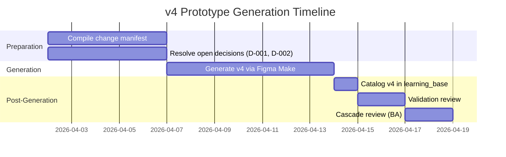

# Plan: Incorporating Stakeholder Feedback into .make Prototype Files

*Created: 2026-04-02 | Owner: ProductOwner | Status: Ready for Execution*

---

## Context

The HTP-VIP mobile prototype uses **Figma Make AI** (Make.com scenario exports) to generate screen designs. These `.make` files are **binary exports** — they cannot be edited as text and must be imported into Make.com to view or modify.

### Current .make File Lineage

| Version | Date | File | Feedback Incorporated |
|---------|------|------|----------------------|
| v1 | 2026-03-11 | `_intake/Mobile app screens for HTP-VIP.make` | Initial 10-screen prototype |
| v2 | 2026-03-31 | `_intake/03-31-2026/Mobile app screens for HTP-VIP Prototype v2.make` | VoC-007 prototype session decisions |
| **v3** | **2026-04-01** | `_intake/04-02-2026/Mobile app screens for HTP-VIP Prorotype v3.make` | **VoC-008 (Mar 30 Mural) — partial** |
| v4 | TBD | *To be generated* | **VoC-008 remaining items + VoC-009 (Apr 4 Mural) — full** |

---

## What v3 Already Incorporates (VoC-008)

Per the [mural_notes.md header](learning_base/_intake/04-02-2026/mural_notes.md): "edits were made on April 1, 2026 using notes from March 30, 2026 Mural Review."

| VoC-008 Item | Status in v3 |
|-------------|-------------|
| FR2: Trial/plot QR visual differentiator | ✅ Likely incorporated |
| FR3: Rename "Physiological Stage" → "Workflow" | ✅ Likely incorporated |
| FR4: Consolidated trial selection screen | ✅ Likely incorporated |
| FR5: Audio notification for angle/direction | ✅ Likely incorporated |
| FR6: QR read buzz | ✅ Likely incorporated |
| FR7: Default device settings | ✅ Likely incorporated |
| FR1: QR scan to start capture | ⚠️ Verify in v3 |
| FR8: Weight entry scope decision | ❌ Decision pending (not in v3) |

---

## What v4 Must Incorporate

### From VoC-009 (April 4 Mural — Roy + Harrison)

All 12 items are **not reflected** in any existing .make file:

| Priority | Screen | Change | VoC-009 Ref |
|----------|--------|--------|-------------|
| 🔴 Critical | S6/S7 | Delete button visible only after cloud upload | FR2 |
| 🔴 Critical | S9 | QR-per-row weight entry; max 30; kg not g | FR4 |
| 🔴 Critical | S1/S2 | User-specific trial ID display on home screen | FR8 |
| 🔴 Critical | ALL | Explicit trial vs plot counts — never combine | FR9 |
| 🔴 Critical | S4 | Real-time plot ID indication during capture | FR11 |
| 🟡 Important | S1/S2 | Username/PW login placeholder | FR1 |
| 🟡 Important | S6/S7 | WiFi-first upload; cellular fallback option | FR3 |
| 🟡 Important | S6/S7 | Excel export format (TRIALID, BARCD, PLOTID, WEIGHT_1) | FR5 |
| 🟡 Important | S3 | Location filter from SPIRIT/datalake (LOCSL) | FR6 |
| 🟡 Important | S3 | EPPYCap workflow naming | FR7 |
| 🟢 Nice-to-have | S4 | Temperature indicator on screen | FR10 |
| 🟢 Nice-to-have | S4 | Remove zoom icon | FR12 |

### From VoC-008 (residual items)

| Priority | Screen | Change | VoC-008 Ref |
|----------|--------|--------|-------------|
| 🔴 Critical | S1 | Verify: external user login handling (parking lot — mark as future) | PP: Ramón |
| 🔴 Critical | S9/S10 | Weight entry scope: keep or remove (decision pending D-001) | FR8 |

---

## v4 Generation Process

### Step 1: Compile Screen-Level Change Manifest

Create a structured prompt document for Figma Make AI containing:

```
For each screen:
  - Screen ID (S1, S2, etc.)
  - Current state (from v3)
  - Required changes (from VoC-009 + VoC-008 residual)
  - Priority (Critical / Important / Nice-to-have)
  - Acceptance criteria from backlog items
```

**Owner**: ProductOwner
**Deadline**: 2026-04-07
**Output**: `learning_base/05_technical_specs/v4_prototype_change_manifest.md`

### Step 2: Resolve Open Decisions

Before generating v4, these decisions **must** be resolved:

| Decision | Impact on .make | Stakeholders | Deadline |
|----------|----------------|-------------|----------|
| D-001: Weight entry scope | If kept: S9 gets QR-per-row redesign. If deferred: S9/S10 removed entirely. | Quentin, Roy, Soumitra, PO | 2026-04-07 |
| D-002: User-specific trial filtering | Determines S1/S2 home screen data logic | Roy, Architect, PO | 2026-04-07 |

**Owner**: ProductOwner (facilitate stakeholder alignment)

### Step 3: Generate v4 via Figma Make

Import the change manifest as a prompt into the Figma Make AI tool:

1. Open Make.com and import `v3.make` as the base scenario
2. Apply the screen-level change manifest as modification instructions
3. Review generated screens against VoC-009 acceptance criteria
4. Export as `Mobile app screens for HTP-VIP Prototype v4.make`

**Owner**: UIUXDesigner (Harrison or delegate)
**Deadline**: 2026-04-14
**Output**: New `.make` file → `_intake/04-XX-2026/`

### Step 4: Catalog v4 in Learning Base

1. ProductOwner creates intake log for v4
2. ProductOwner creates `05_6_mobile_app_screens_figma_make_v4.md` with v1→v2→v3→v4 lineage
3. Cross-reference VoC-008 and VoC-009 items as incorporated

**Owner**: ProductOwner
**Deadline**: Same day as v4 receipt

### Step 5: Validation Review

1. Side-by-side comparison: v3 vs v4 against change manifest
2. Verify all Critical items addressed
3. Verify Important items addressed (or captured in backlog if deferred)
4. Screenshot key screens for non-Make.com stakeholders

**Owner**: ProductOwner + BusinessAnalyst
**Deadline**: Within 2 days of v4 generation

### Step 6: Cascade Review

Run cascade review from v4 changes:
- `05_technical_specs/screen_inventory_one_pager_prototypeSession.md` — update screen descriptions
- `05_technical_specs/guardrails_one_pager_prototypeSession.md` — update guardrail UI descriptions
- `02_requirements/02_1_requirements_matrix_summary.md` — verify new requirements mapped to screens

**Owner**: BusinessAnalyst
**Deadline**: 2026-04-16

---

## Timeline Summary



---

## Handoffs

| From | To | Trigger | Input | Expected Output |
|------|----|---------|-------|----------------|
| ProductOwner | Stakeholders (Quentin, Roy, Soumitra) | 2026-04-02 | D-001 and D-002 decision briefs | Decisions by 2026-04-07 |
| ProductOwner | UIUXDesigner | After decisions resolved | Change manifest + v3.make base | v4.make file by 2026-04-14 |
| ProductOwner | BusinessAnalyst | After v4 catalogued | v4 catalog entry + VoC-008/009 | Cascade review by 2026-04-16 |
| ProductOwner | ScrumMaster | After backlog groomed | Groomed backlog (BL-023 through BL-072) | Sprint plan for next iteration |

---

## Risk Register

| Risk | Likelihood | Impact | Mitigation |
|------|-----------|--------|-----------|
| D-001 (weight entry) not resolved by deadline | Medium | High — blocks S9 redesign | Escalate to ProjectManager; generate v4 with S9 as "placeholder pending decision" |
| Figma Make AI produces inaccurate screen updates | Medium | Medium — requires manual correction | Validate each screen against change manifest; iterate if needed |
| v3 .make cannot be imported into Make.com (binary compatibility) | Low | High — cannot build on v3 | Fall back to v2 as base and reapply all Mar 30 + Apr 4 changes |
| Stakeholder misalignment on terminology (Workflow vs Physiological Stage) | Low | Low | Already resolved in VoC-008 and confirmed by Harrison |
