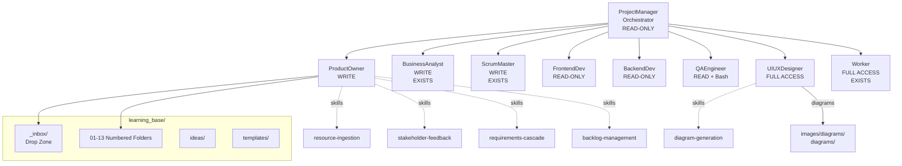

# PM Agent Coordination System — Implementation Plan

> **Date**: 2026-03-18
> **Status**: Proposed
> **Project**: HTP-VIP (Vegetable Intelligent Phenotyping)
> **Framework**: mcouthon/agents (C:\Users\s1058662\repos\agents-personal)

---

## 1. Executive Summary

Build a suite of 6 new agents + 5 new skills that mirror a real software project team, coordinated by a Conductor-style PM orchestrator. The system ingests mixed-format resources (emails, PDFs, Word docs, chat logs, URLs) into `learning_base/`, automates requirement cascade reviews, generates diagrams (Mermaid + draw.io), and coordinates stakeholder/developer feedback loops.

**Adds to existing 9 agents + 23 skills → Total: 15 agents + 28 skills.**

---

## 2. Architecture Overview



---

## 3. New Agents — Detailed Specifications

### 3.1 ProjectManager (PM) — Conductor-Style Orchestrator

**File**: `templates/agents/project-manager.template.md`

**Frontmatter**:
```yaml
name: ProjectManager
description: "PM orchestrator for HTP-VIP. Coordinates PO, BA, SM, FE Dev, BE Dev, QA, UI/UX, and Worker sub-agents across 6 project management workflows. Maintains user control at all decision points."

copilot:
  tools: ["vscode/askQuestions", "read/readFile", "agent", "search/fileSearch", "search/listDirectory", "todo"]
  agents: ["ProductOwner", "BusinessAnalyst", "ScrumMaster", "FrontendDev", "BackendDev", "QAEngineer", "UIUXDesigner", "Worker"]
  model: ["opus", "sonnet"]
  disable-model-invocation: true

```

**Access**: READ-ONLY. Delegates all work. Never edits files, never runs commands.

**Key body sections**:
- Entry Gate: Read `learning_base/` + `.tasks/` before any response
- Agent Capabilities Table (8 agents with access levels)
- 6 Workflow Definitions (see Section 5)
- Mandatory Checkpoint Enforcement (borrowed from Conductor)
- Rationalization Prevention Table (PM-specific)
- Execution State tracking via todo list + task.md

---

### 3.2 ProductOwner (PO)

**File**: `templates/agents/product-owner.template.md`

**Frontmatter**:
```yaml
name: ProductOwner
description: "Product vision, backlog management, stakeholder feedback processing, and resource ingestion for HTP-VIP. Classifies and routes incoming resources into learning_base/."

copilot:
  tools: ["vscode/askQuestions", "read/problems", "read/readFile", "agent", "edit/createDirectory", "edit/createFile", "edit/editFiles", "search", "web", "todo"]
  model: ["opus", "sonnet"]
  user-invokable: true
  handoffs:
    - label: Update Requirements
      agent: Business Analyst
      prompt: "Update requirements based on the stakeholder feedback just processed."
      send: true
    - label: Plan Sprint
      agent: Scrum Master
      prompt: "Take these prioritized backlog items and create a sprint plan."
      send: true


```

**Access**: WRITE (Edit, Write). No Bash. Same pattern as Business Analyst.

**Key body sections**:
- Role: stakeholder voice, backlog curator, resource classifier
- Project Context: references to docs/htp_vip_vision.md, learning_base/02_requirements/, etc.
- Domain Language table (Trial, Plot, Germplasm, Guardrail, etc.)
- Skill trigger phrases: "ingest this document", "process feedback from", "run cascade review", "groom the backlog"
- Save locations: VoC → `11_voice_of_customer/`, backlog → `docs/ways-of-work/backlog.md`

---

### 3.3 FrontendDev

**File**: `templates/agents/frontend-dev.template.md`

**Frontmatter**:
```yaml
name: FrontendDev
description: "READ-ONLY frontend architecture advisor for HTP-VIP. Reviews React Native implementations, accessibility, offline-first mobile patterns, and component architecture."

copilot:
  tools: ["vscode/askQuestions", "read/problems", "read/readFile", "agent", "search", "web", "todo"]
  model: ["opus", "sonnet"]
  user-invokable: true
  handoffs:
    - label: Design Review
      agent: UIUXDesigner
      prompt: "Review the design for these UI components."
      send: true

```

**Access**: READ-ONLY. Purely advisory.

**Key body sections**:
- HTP-VIP Frontend Stack: React Native, Redux, SQLite, presigned S3, ZXing/ML Kit
- Review Checklist: component architecture, offline-first patterns, performance, accessibility, state management
- Output: structured review with severity ratings and file/line references

---

### 3.4 BackendDev

**File**: `templates/agents/backend-dev.template.md`

**Frontmatter**:
```yaml
name: BackendDev
description: "READ-ONLY backend architecture advisor for HTP-VIP. Reviews API design, PostgreSQL/PostGIS schemas, AWS infrastructure, and processing pipelines."

copilot:
  tools: ["vscode/askQuestions", "read/problems", "read/readFile", "agent", "search", "web", "todo"]
  model: ["opus", "sonnet"]
  user-invokable: true

```

**Access**: READ-ONLY. Purely advisory.

**Key body sections**:
- HTP-VIP Backend Stack: FastAPI, PostgreSQL + PostGIS, S3, SQS/SNS, Celery, SPIRIT
- Review Areas: API design, data model integrity, processing pipeline, SPIRIT integration, security, scalability
- Output: structured review with severity ratings

---

### 3.5 QAEngineer

**File**: `templates/agents/qa-engineer.template.md`

**Frontmatter**:
```yaml
name: QAEngineer
description: "Testing strategy, quality verification, and bug documentation for HTP-VIP. Reviews test coverage, runs test suites, and validates quality gates."

copilot:
  tools: ["vscode/askQuestions", "execute/testFailure", "execute/getTerminalOutput", "execute/awaitTerminal", "execute/runInTerminal", "execute/runTests", "read/problems", "read/readFile", "read/terminalSelection", "read/terminalLastCommand", "agent", "search", "todo"]
  model: ["opus", "sonnet"]
  user-invokable: true
  handoffs:
    - label: Fix Issue
      agent: Builder
      prompt: "Fix the bugs identified in this QA report."
      send: false
```

**Access**: READ + Bash. Can run tests but cannot modify code. Same pattern as Reviewer.

**Key body sections**:
- Quality Standards: guardrail severity levels (G1-G13), offline-first test scenarios
- Test Strategy: unit, integration, E2E, mobile-specific, performance
- Bug Report Template: reproduction steps, expected vs actual, severity, guardrail mapping
- Output: PASS / NEEDS_WORK / FAIL with evidence

---

### 3.6 UIUXDesigner

**File**: `templates/agents/uiux-designer.template.md`

**Frontmatter**:
```yaml
name: UIUXDesigner
description: "Interface design, wireframes, Mermaid diagrams, draw.io XML creation, and user experience design for HTP-VIP. Creates and updates all visual artefacts."

copilot:
  tools: ["vscode/askQuestions", "read/problems", "read/readFile", "agent", "edit/createDirectory", "edit/createFile", "edit/editFiles", "execute/runInTerminal", "execute/getTerminalOutput", "search", "web", "todo"]
  model: ["opus", "sonnet"]
  user-invokable: true
  handoffs:
    - label: Frontend Review
      agent: FrontendDev
      prompt: "Review these designs for implementation feasibility."
      send: true
```

**Access**: FULL (edit + execute). Needs execute/runInTerminal for `scripts/render_mermaid_diagrams.ps1`, edit tools for .mmd/.drawio files.

**Key body sections**:
- Design Context: mobile-first field app (harsh lighting, gloves, one-handed operation)
- Mermaid Workflow: save .mmd → run render script → insert PNG → update manifest (from copilot-instructions.md)
- Draw.io Workflow: create .drawio XML → save to diagrams/{category}/
- Artefact Types: user journeys (flowchart), architecture (draw.io + mermaid), ERDs (erDiagram), wireframes (markdown), component interactions (sequence)
- Save Locations: .mmd → `images/diagrams/NN_*.mmd`, .drawio → `diagrams/{category}/vip_*.drawio`, design specs → `docs/design/`

---

## 4. New Skills — Detailed Specifications

All in `templates/skills/{name}/SKILL.template.md`

### 4.1 resource-ingestion

**Purpose**: Convert mixed-format files into structured .md in learning_base/

**Format support matrix**:
| Format | Conversion Method | Agent Needed |
|--------|------------------|--------------|
| .md | Direct (already markdown) | PO only |
| .pdf | Read tool (native PDF support) | PO only |
| .txt/.csv | Direct read + format | PO only |
| .docx | `pandoc -t markdown` (Bash) | Worker → PO |
| .eml/.msg | Python email/extract-msg (Bash) | Worker → PO |
| URLs | WebFetch (summarize) | PO only |

**Classification rules** (content → learning_base/ folder):
| Content Type | Target Folder | Template Used |
|-------------|---------------|---------------|
| Meeting notes | `10_meeting_notes/` | `templates/meeting_notes.md` |
| Stakeholder feedback | `11_voice_of_customer/` | `templates/voice_of_customer.md` |
| Requirements/features | `02_requirements/` | freeform .md |
| Architecture decisions | `09_decisions/` | `templates/decision_record.md` |
| Blockers/issues | `12_roadblocks/` | `templates/roadblock.md` |
| Data model changes | `04_data_models/` | `templates/entity_definition.md` |
| Technical specs | `05_technical_specs/` | freeform .md |
| General ideas | `ideas/` | freeform (READ-ONLY note added) |

**Metadata header** added to every ingested resource:
```yaml
---
source_file: "original_filename.ext"
source_type: email | document | meeting_notes | chat | web
ingested_date: YYYY-MM-DD
author: "[extracted]"
related_feature: "[feature area]"
classification: "[folder number]"
tags: ["tag1", "tag2"]
---
```

### 4.2 diagram-generation

**Purpose**: Create/update Mermaid .mmd and draw.io .drawio XML files

**Mermaid workflow** (from `.github/copilot-instructions.md`):
1. Write .mmd source to `images/diagrams/NN_short_description.mmd`
2. Run `scripts/render_mermaid_diagrams.ps1`
3. Insert PNG image reference in target document
4. Update `diagram_manifest.json`

**Supported diagram types**:
- `flowchart` — workflows, processes, state machines
- `erDiagram` — entity relationships, data models
- `sequenceDiagram` — API interactions, user flows
- `gantt` — timelines, roadmap, sprint plans
- `classDiagram` — object models, component hierarchy
- `stateDiagram-v2` — guardrail states, capture session lifecycle

**Draw.io XML workflow**:
- Includes valid `<mxfile>` / `<diagram>` / `<mxGraphModel>` envelope templates
- Cell creation patterns for common shapes
- Save to `diagrams/{category}/vip_{description}.drawio`
- Categories: architecture, workflows, deployment, implementation, technical_features, user_journeys, vision

### 4.3 stakeholder-feedback

**Purpose**: Transform raw stakeholder input into structured VoC records

**Processing steps**:
1. Extract verbatim quotes from input
2. Identify pain points + quantify (frequency, rework time)
3. Map to existing guardrails (G1-G13) where applicable
4. Extract feature requests with priority classification
5. Document workflow observations
6. Generate actionable insights
7. Write to `learning_base/11_voice_of_customer/voc_NNN_*.md` using template
8. Flag downstream docs for review per REVIEW_WORKFLOW.md

**Pattern**: follows existing `voc_001_video_processor_zakaria.md` and `voc_002_video_collector_ling.md`

### 4.4 requirements-cascade

**Purpose**: Automate the REVIEW_WORKFLOW.md cascade review process

**Dependency matrix** (encoded from REVIEW_WORKFLOW.md):
```
ideas/*                 → 01_project_overview/, 02_requirements/
01_project_overview/    → 02_requirements/, 03_architecture/
02_requirements/        → 03_architecture/, 04_data_models/, 05_technical_specs/
03_architecture/        → 04_data_models/, 05_technical_specs/, diagrams/
04_data_models/         → 05_technical_specs/, diagrams/data_model_erd.md
05_technical_specs/     → 06_implementation/, 07_testing/
09_decisions/           → ALL technical documents
10_meeting_notes/       → Extract action items → route to folders
11_voice_of_customer/   → 02_requirements/, 01_project_overview/
12_roadblocks/          → 06_implementation/, 09_decisions/
```

**Process**: Identify change → lookup downstream deps → check references → flag/update → regenerate diagrams if needed → log in CHANGELOG

### 4.5 backlog-management

**Purpose**: MoSCoW prioritization and phase-aligned backlog tracking

**Backlog schema**:
```markdown
| ID | Title | Phase | MoSCoW | Stakeholder Value | Effort | Dependencies | Status |
```

**Phase alignment**:
- Phase 1/MVP: Must-haves only (offline capture, QR scanning, presigned S3)
- Phase 2: Should-haves (cloud pipeline, guardrails, SPIRIT)
- Phase 3: Could-haves (ML inference, advanced QA)
- Phase 4: Won't-haves-yet (REST API, multi-tenancy)

**References**: existing `planner_updates/requirements_moscow_matrix_harrison.md` for baseline

---

## 5. PM Orchestration Workflows

### 5.1 Resource Ingestion
```
Trigger: "ingest this [resource]"
PM → Worker (convert .docx/.eml/.msg → .md if needed)
   → PO (classify + route via resource-ingestion skill)
   → CHECKPOINT: Resource classified. Approve placement?
   → PO (write to target folder, apply template)
   → PO (requirements-cascade: check downstream docs)
   → CHECKPOINT: Cascade review complete. N documents flagged.
```

### 5.2 Stakeholder Feedback Processing
```
Trigger: "process feedback from [stakeholder]"
PM → PO (stakeholder-feedback skill → create VoC record)
   → CHECKPOINT: VoC record created. Review?
   → BA (update requirements if VoC reveals new needs)
   → PO (requirements-cascade: propagate changes)
   → UI/UX (update user journey diagrams if workflows changed)
   → CHECKPOINT: All updates complete. Review summary.
```

### 5.3 Sprint Planning
```
Trigger: "plan sprint N"
PM → PO (backlog-management: groom + prioritize)
   → CHECKPOINT: Backlog priorities. Approve?
   → SM (breakdown-plan: create sprint plan)
   → CHECKPOINT: Sprint plan ready. Approve?
   → BE (review technical feasibility — backend items)
   → FE (review technical feasibility — frontend items)
   → QA (create test plan for sprint items)
   → CHECKPOINT: All reviews complete. Final sprint plan.
```

### 5.4 Design Review
```
Trigger: "review design for [feature]"
PM → UI/UX (create/update wireframes + diagrams)
   → CHECKPOINT: Design artefacts created. Review?
   → FE (review for feasibility, accessibility, mobile-first)
   → CHECKPOINT: Design review findings. Approve/revise?
   → UI/UX (revise if needed)
   → CHECKPOINT: Final design approved.
```

### 5.5 Architecture Review
```
Trigger: "review architecture for [component]"
PM → BE (architecture + critic: review, identify risks)
   → CHECKPOINT: Architecture review findings.
   → BA (check requirements alignment)
   → QA (identify testability concerns)
   → CHECKPOINT: All reviews complete. Decision needed?
   → BA (create ADR in 09_decisions/ if decision made)
   → UI/UX (update architecture diagrams)
   → PO (requirements-cascade: propagate changes)
```

### 5.6 Quality Gate
```
Trigger: "run quality check"
PM → QA (run tests, coverage, quality metrics)
   → CHECKPOINT: QA results. PASS/FAIL?
   → If FAIL: BE/FE (root cause analysis) → CHECKPOINT: Fix plan?
   → If PASS: PO (update backlog status) + SM (update plan status)
```

---

## 6. learning_base Ingestion Pipeline

### 6.1 _inbox Convention

Add `learning_base/_inbox/` as a drop zone for unprocessed resources:
1. User drops files into `_inbox/`
2. User invokes PM: "Ingest new resources"
3. PM scans `_inbox/`, delegates conversion + classification
4. Processed files move to appropriate numbered folders
5. `_inbox/` is cleaned after successful ingestion

### 6.2 Two-Stage Processing

**Stage 1 — Conversion (Worker agent, has Bash)**:
- .docx → markdown via `pandoc -t markdown`
- .eml → text via Python `email.parser`
- .msg → text via `extract-msg` or `msgconvert`
- Other formats (PDF, .md, .txt, .csv, URLs) skip this stage

**Stage 2 — Classification + Routing (PO agent, resource-ingestion skill)**:
- Read converted content
- Classify into one of 13 learning_base categories
- Apply appropriate template from `learning_base/templates/`
- Write structured .md to target folder with metadata header
- Trigger cascade review for downstream dependency check

---

## 7. Implementation Phases

### Phase 1: Skill Templates (5 skills) — No dependencies
```
templates/skills/resource-ingestion/SKILL.template.md
templates/skills/diagram-generation/SKILL.template.md
templates/skills/stakeholder-feedback/SKILL.template.md
templates/skills/requirements-cascade/SKILL.template.md
templates/skills/backlog-management/SKILL.template.md
```

### Phase 2: Leaf Agent Templates (4 agents) — Depends on Phase 1
```
templates/agents/frontend-dev.template.md
templates/agents/backend-dev.template.md
templates/agents/qa-engineer.template.md
templates/agents/uiux-designer.template.md      ← needs diagram-generation skill
```

### Phase 3: Product Owner Agent — Depends on Phase 1
```
templates/agents/product-owner.template.md       ← needs all 4 PO skills
```

### Phase 4: PM Orchestrator — Depends on Phases 2 + 3
```
templates/agents/project-manager.template.md     ← needs all sub-agent names
```

### Phase 5: VIP Project Configuration — Depends on Phase 4
- Create `learning_base/_inbox/` directory
- Update `learning_base/README.md` with _inbox docs
- Run `make && ./install.sh`
- Validate generated output

### Phase 6: Integration Testing — Depends on Phase 5
- Individual agent tests
- PM workflow end-to-end tests (VS Code Copilot)
- Constraint verification (read-only agents cannot edit, execute-restricted agents cannot run commands)

---

## 8. Agent Access Summary

| Agent | Read | Edit/Write | Execute | Model | New? |
|-------|------|-----------|---------|-------|------|
| ProjectManager | .tasks/, learning_base/ | No | No | ["opus", "sonnet"] | NEW |
| ProductOwner | All | learning_base/, docs/ | No | ["opus", "sonnet"] | NEW |
| BusinessAnalyst | All | docs/, learning_base/, specs/ | No | ["opus", "sonnet"] | EXISTS |
| ScrumMaster | All | docs/ways-of-work/ | No | ["opus", "sonnet"] | EXISTS |
| FrontendDev | All | No | No | ["opus", "sonnet"] | NEW |
| BackendDev | All | No | No | ["opus", "sonnet"] | NEW |
| QAEngineer | All | No | Yes (tests only) | ["opus", "sonnet"] | NEW |
| UIUXDesigner | All | diagrams/, images/, docs/ | Yes (render) | ["opus", "sonnet"] | NEW |

---

## 9. Critical Reference Files

| File | Why It Matters |
|------|---------------|
| `agents-personal/templates/agents/conductor.template.md` | PM orchestrator pattern (checkpoints, Entry Gate, workflow steps) |
| `agents-personal/templates/agents/business-analyst.template.md` | Role agent pattern (domain context, skills, handoffs) |
| `agents-personal/templates/skills/deep-research/SKILL.template.md` | Skill template pattern (name, description, body structure) |
| `VIP/learning_base/REVIEW_WORKFLOW.md` | Cascade dependency matrix for requirements-cascade skill |
| `VIP/.github/copilot-instructions.md` | Mermaid workflow for diagram-generation skill |
| `agents-personal/scripts/generate.js` | Template compilation pipeline |
| `agents-personal/templates/README.md` | Template format specification |

---

## 10. Microsoft Planner Task Reporting Schema

Agents that produce task output (PM, PO, SM, BA) must generate task data compatible with the Microsoft Planner export format used in Teams Projects. This enables direct import into the "Test - agent planner" project or any Teams project board.

### 10.1 Project-Level Fields

| Field | Type | Example | Notes |
|-------|------|---------|-------|
| Project name | string | "HTP-VIP Sprint 3" | Set per sprint/epic |
| Plan owner | string | "Harrison Fuller" | Project lead |
| Project start date | date | 2026-03-18 | Sprint/phase start |
| Project finish date | date | 2026-04-01 | Sprint/phase end |
| Duration | string | "10 days" | Auto-calculated |
| % complete | integer | 0-100 | Aggregated from tasks |
| Exported on | date | auto | Export timestamp |

### 10.2 Task-Level Fields (Export Schema)

| Field | Type | Required | Example | Notes |
|-------|------|----------|---------|-------|
| Task number | integer | auto | 1 | Sequential, auto-assigned |
| Outline number | integer | auto | 1 | Hierarchical position |
| Name | string | Yes | "Implement QR barcode scanner" | Task title, concise |
| Assigned to | string | Yes | "Harrison Fuller" | Team member name |
| Start | date | Yes | 2026-03-18 | Task start date |
| Finish | date | Yes | 2026-03-20 | Task end date |
| Duration | string | auto | "2 days" | Calculated from start/finish |
| Bucket | string | Yes | "Phase 1 - MVP" | Maps to Planner buckets |
| % complete | integer | Yes | 0 | Progress: 0, 25, 50, 75, 100 |
| Priority | enum | Yes | "Medium" | Urgent, Important, Medium, Low |
| Labels | string | No | "Pink" | Color labels for categorization |
| Depends on | string | No | "Task 3" | Predecessor task references |
| Dependents (after) | string | No | "Task 7" | Successor task references |
| Effort | string | Yes | "8 hours" | Estimated effort |
| Effort completed | string | auto | "0 hours" | Tracked effort spent |
| Effort remaining | string | auto | "8 hours" | Remaining effort |
| Milestone | boolean | No | No | Yes/No milestone flag |
| Notes | string | No | "Requires ZXing library" | Additional context |
| Sprint | string | No | "Sprint 1" | Sprint assignment |
| Goal | string | No | "Backlog" | Maps to Project Goals tab |

### 10.3 Project Goals Tab Schema

| Field | Type | Example | Notes |
|-------|------|---------|-------|
| Goal name | string | "agent setup" | High-level objective |
| Status | enum | "Not started" | Not started, On track, At risk, Behind, Completed |
| Start date | date | 2026-03-18 | Goal timeframe start |
| End date | date | 2026-06-30 | Goal timeframe end |

Goals map to MoSCoW priorities and delivery phases:

| Goal | Phase | MoSCoW |
|------|-------|--------|
| MVP Delivery | Phase 1 | Must |
| Cloud Pipeline | Phase 2 | Should |
| ML & Advanced QA | Phase 3 | Could |
| REST API & Multi-tenancy | Phase 4 | Won't (yet) |

### 10.4 Agent Responsibilities for Task Output

| Agent | Task Output Role |
|-------|-----------------|
| **ScrumMaster** | Primary task creator — generates full task schemas from sprint plans via `breakdown-plan` skill |
| **ProductOwner** | Creates backlog items with Goal mapping, Priority, and Effort estimates |
| **BusinessAnalyst** | Generates epic/feature task hierarchies via `breakdown-epic-pm` skill |
| **ProjectManager** | Aggregates task status across workflows, updates % complete and milestone flags |

### 10.5 Export Format Convention

Agents should generate task data as markdown tables matching the Planner schema, saved to:
- Sprint tasks: `docs/ways-of-work/plan/{sprint-name}/tasks.md`
- Epic tasks: `docs/ways-of-work/plan/{epic-name}/tasks.md`

Tables can be exported to CSV for Planner import using standard markdown-to-CSV tooling.

---

## 11. Source Alignment with agents-personal Framework

This section documents how each design decision in this plan traces back to established conventions in the `agents-personal` repo (`C:\Users\s1058662\repos\agents-personal`).

### 11.1 Template Structure Conventions

| Convention | Source | How This Plan Follows It |
|-----------|--------|--------------------------|
| Agent filename pattern | `templates/README.md` line 212: `{name}.template.md` | All 6 new agents use `{name}.template.md` naming |
| Skill directory pattern | `templates/README.md` line 213: `{name}/SKILL.template.md` | All 5 new skills use `templates/skills/{name}/SKILL.template.md` |
| YAML frontmatter: `name` + `description` + `copilot:` | `templates/README.md` lines 19-53 | All agent specs include required `name`, `description`, `copilot:` sections |
| Auto-discovery by generator | `scripts/generate.js` `discoverAgentTemplates()` | No Makefile changes needed — new files in `templates/agents/` auto-discovered |
| `install.sh` validation list | `install.sh` lines 222-259 `check_generated_files()` | New agent/skill names must be added to validation list |

### 11.2 Tool Permission Patterns

| Access Level | Source Pattern | Copilot Tools | Used By (New) |
|-------------|---------------|---------------|---------------|
| **PM Write** (edit, no execute) | `business-analyst.template.md` lines 7-18 | `askQuestions, read/problems, read/readFile, agent, edit/createDirectory, edit/createFile, edit/editFiles, search, web, todo` | ProductOwner |
| **Read-Only** (no edit, no execute) | BA tools minus `edit/*` | `askQuestions, read/problems, read/readFile, agent, search, web, todo` | FrontendDev, BackendDev |
| **Read + Execute** (tests only) | `reviewer.template.md` tools | `askQuestions, execute/*, read/*, agent, search, todo` | QAEngineer |
| **Full** (edit + execute) | BA tools + `execute/*` | `askQuestions, read/*, edit/*, execute/runInTerminal, execute/getTerminalOutput, agent, search, web, todo` | UIUXDesigner |
| **Orchestrator** (delegate only) | `conductor.template.md` lines 5-17 | `askQuestions, read/readFile, agent, search/fileSearch, search/listDirectory, todo` + `disable-model-invocation: true` | ProjectManager |

### 11.3 Body Content Conventions

Every new agent body MUST include these sections (established by `business-analyst.template.md` and `scrum-master.template.md`):

| Section | Source | Line Ref |
|---------|--------|----------|
| `# {Agent Name} Mode` title | `business-analyst.template.md:51` | Standard heading format |
| Role paragraph | `business-analyst.template.md:53-57` | One paragraph defining responsibility |
| **Project Context** with path + document reference table | `business-analyst.template.md:59-76` | Project path: `c:\Users\...\2026_01_VIP`, doc table: Document / Path / Purpose |
| **Core Domain Language** table | `business-analyst.template.md:78-91` | Terms: Trial, Plot, Germplasm, Capture session, Guardrail, Operator, Trial Manager, SPIRIT |
| **Available Skills** table (Skill / Trigger phrases / Output location) | `business-analyst.template.md:93-102` | Maps skills to trigger phrases and save locations |
| Numbered **Workflow** (Understand → Apply Skill → Write → Save) | `business-analyst.template.md:104-138` | Step 1-4 pattern |
| **Save Artefacts** table (Document type / Save location) | `business-analyst.template.md:130-137` | Output path conventions |
| "Read all referenced documents before producing any output" | `business-analyst.template.md:153` | Research-first constraint |

### 11.4 Skill Template Conventions

| Convention | Source | How New Skills Follow It |
|-----------|--------|--------------------------|
| Minimal frontmatter: `name` + `description` only | `breakdown-plan/SKILL.template.md:1-4` | All 5 new skills use `name` + `description` only |
| HTP-VIP Context section with doc references | `prd/SKILL.template.md:19-23` | New skills reference project docs (REVIEW_WORKFLOW.md, copilot-instructions.md) |
| Output format with save location | `breakdown-plan/SKILL.template.md:32-36` | Each skill specifies target folder in learning_base/ or docs/ |
| Work Item Hierarchy: Epic → Feature → Story | `breakdown-plan/SKILL.template.md:16` | backlog-management skill uses same hierarchy |
| Fibonacci estimation (1-13+ for stories) | `breakdown-plan/SKILL.template.md:42` | Task schema Effort field follows this convention |
| Phase alignment (MVP → Phase 2-4) | `scrum-master.template.md:62-68` | backlog-management uses same phase targets |

### 11.5 Orchestrator Conventions (Conductor → PM)

| Convention | Source (conductor.template.md) | PM Adaptation |
|-----------|-------------------------------|---------------|
| Entry Gate: read state before responding | Lines 36-43 | PM reads `learning_base/` + `.tasks/` first |
| Agent Capabilities table (Agent / File Edits / Terminal / Primary Use) | Lines 94-99 | PM has 8-agent table (Section 3.1) |
| Mandatory CHECKPOINT enforcement | Lines 135-168 | All 6 workflows have checkpoints (Section 5) |
| Rationalization Prevention table | Lines 70-79 | PM version: "I'll just classify this myself" → delegate to PO |
| `disable-model-invocation: true` | Line 17 | PM uses same flag — user must invoke explicitly |
| `agents:` array for sub-agent declaration | Line 15 | PM declares 8 agents + Worker |
| Handoff pattern (downstream + self-save) | `business-analyst.template.md:21-29` | PO has Update Requirements → BA, Plan Sprint → SM |

### 11.6 Build & Install Pipeline

| Step | Command | Source |
|------|---------|--------|
| Generate from templates | `make all` or `node scripts/generate.js copilot` | `Makefile:8-14` |
| Validate (dry-run) | `make validate` | `Makefile:17-18` |
| Install to user directories | `make install` or `./install.sh` | `Makefile:30-31`, `install.sh` |
| Copilot output location | `generated/copilot/agents/*.agent.md` | `templates/README.md:204-208` |
| Skill output location | `generated/copilot/skills/*/SKILL.md` | `templates/README.md:204-208` |

---

## 12. Reference Skills & Instructions (from awesome-copilot)

Resources collected in `learning_base/ideas/skills and instructions/` that inform the design of new agents and skills.

### 12.1 Existing Repo Skills (zipped — already in agents-personal)

These are the source versions of skills already installed via the agents-personal framework. Included here for offline reference.

| Skill (zip) | Consumed By | Relevance |
|-------------|-------------|-----------|
| `breakdown-plan.zip` | ScrumMaster | Sprint/project planning with Epic → Story hierarchy |
| `breakdown-epic-pm.zip` | BusinessAnalyst | Epic PRD creation template |
| `breakdown-epic-arch.zip` | ScrumMaster | Technical architecture for epics |
| `breakdown-feature-prd.zip` | BusinessAnalyst | Feature-level PRD template |
| `prd.zip` | BusinessAnalyst | Product Requirements Documents |
| `update-specification.zip` | BusinessAnalyst | Spec updates with REQ-/SEC-/CON- prefixes |
| `update-implementation-plan.zip` | ScrumMaster | Phase plan updates in `.tasks/` |
| `architecture-blueprint-generator.zip` | BackendDev (reference) | Architecture documentation patterns |
| `folder-structure-blueprint-generator.zip` | ScrumMaster | Project organization analysis |
| `project-workflow-analysis-blueprint-generator.zip` | ScrumMaster | Workflow documentation |
| `readme-blueprint-generator.zip` | ScrumMaster | README generation from project analysis |

### 12.2 New Skills from awesome-copilot (unzipped — candidates for adoption)

These skills were sourced from [github/awesome-copilot](https://github.com/github/awesome-copilot) and provide patterns for the new agents.

| Skill | Path | Relevant To | Key Patterns to Adopt |
|-------|------|-------------|----------------------|
| **resource-visualizer** | `resource-visualizer/SKILL.md` | UIUXDesigner | Architecture diagram generation from codebase analysis; includes `template-architecture.md` asset for Mermaid output scaffolding |
| **web-design-reviewer** | `web-design-reviewer/SKILL.md` | FrontendDev | Structured design review with severity ratings (P1/P2/P3), viewport testing matrix, Playwright MCP integration for browser automation |
| **premium-frontend-ui** | `premium-frontend-ui/SKILL.md` | FrontendDev, UIUXDesigner | Professional UI design patterns, design system conventions |
| **webapp-testing** | `webapp-testing/SKILL.md` | QAEngineer | Web application testing patterns with `test-helper.js` asset for test scaffolding |
| **cloud-design-patterns** | `cloud-design-patterns/SKILL.md` | BackendDev | 42 cloud architecture patterns across 7 categories (reliability, performance, messaging, security, deployment) with 8 reference docs |
| **cosmosdb-datamodeling** | `cosmosdb-datamodeling/SKILL.md` | BackendDev (reference) | NoSQL data modeling patterns (applicable concepts for PostGIS schema decisions) |
| **create-implementation-plan** | `create-implementation-plan/SKILL.md` | ScrumMaster, PM | Implementation plan generation patterns |

### 12.3 How These Inform New Agent Design

| New Agent | Skills Informing Its Design | Patterns Adopted |
|-----------|---------------------------|-----------------|
| **FrontendDev** | web-design-reviewer, premium-frontend-ui | Severity-rated review output (P1/P2/P3), viewport testing checklist, accessibility audit structure |
| **BackendDev** | cloud-design-patterns, cosmosdb-datamodeling | Architecture review categories (reliability, security, performance), service mapping tables |
| **QAEngineer** | webapp-testing, web-design-reviewer | Test strategy framework, regression testing workflow, iteration limits (3 attempts before escalation) |
| **UIUXDesigner** | resource-visualizer, premium-frontend-ui | Mermaid diagram scaffolding from `template-architecture.md`, design system upgrade workflow |
| **ProductOwner** | create-implementation-plan | Plan generation structure for backlog item breakdowns |
| **ProjectManager** | create-implementation-plan, breakdown-plan | Orchestration patterns for multi-phase planning with dependency tracking |

---

*Generated: 2026-03-18*
*Updated: 2026-03-18 — Added Sections 10 (Planner Task Schema), 11 (Source Alignment), 12 (Reference Skills)*
